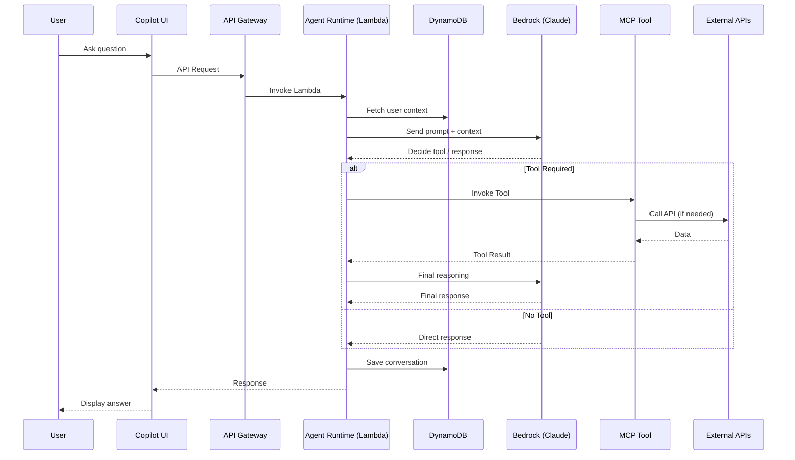

```mermaid

sequenceDiagram
    participant U as User
    participant UI as Copilot UI
    participant AGW as API Gateway
    participant AR as Agent Runtime (Lambda)
    participant DDB as DynamoDB
    participant B as Bedrock (Claude)
    participant MCP as MCP Tool
    participant EXT as External APIs

    U->>UI: Ask question
    UI->>AGW: API Request
    AGW->>AR: Invoke Lambda

    AR->>DDB: Fetch user context
    AR->>B: Send prompt + context

    B-->>AR: Decide tool / response

    alt Tool Required
        AR->>MCP: Invoke Tool
        MCP->>EXT: Call API (if needed)
        EXT-->>MCP: Data
        MCP-->>AR: Tool Result
        AR->>B: Final reasoning
        B-->>AR: Final response
    else No Tool
        B-->>AR: Direct response
    end

    AR->>DDB: Save conversation
    AR-->>UI: Response
    UI-->>U: Display answer
```
