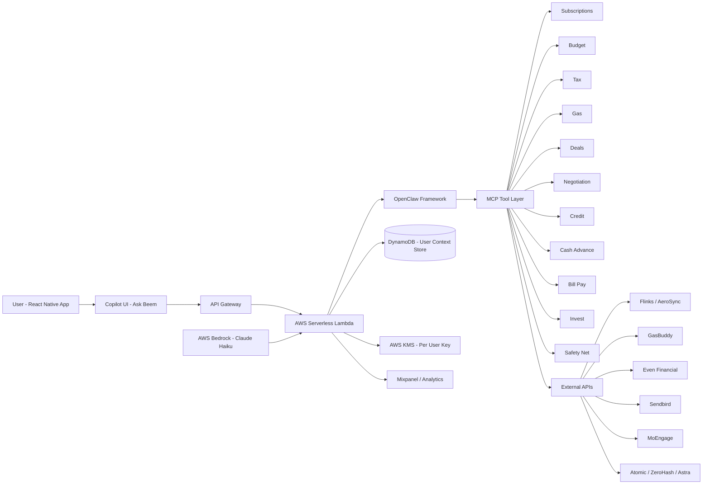

```mermaid
flowchart LR
    U[User - React Native App] --> UI[Copilot UI - Ask Beem]
    UI --> AGW[API Gateway]

    AGW --> LAMBDA[AWS Serverless Lambda]

    LAMBDA --> OC[OpenClaw Framework]

    OC --> MCP[MCP Tool Layer]

    MCP --> T1[Subscriptions]
    MCP --> T2[Budget]
    MCP --> T3[Tax]
    MCP --> T4[Gas]
    MCP --> T5[Deals]
    MCP --> T6[Negotiation]
    MCP --> T7[Credit]
    MCP --> T8[Cash Advance]
    MCP --> T9[Bill Pay]
    MCP --> T10[Invest]
    MCP --> T11[Safety Net]

    MCP --> EXT[External APIs]

    EXT --> F[Flinks / AeroSync]
    EXT --> G[GasBuddy]
    EXT --> E[Even Financial]
    EXT --> S[Sendbird]
    EXT --> M[MoEngage]
    EXT --> A[Atomic / ZeroHash / Astra]

    LAMBDA --> DDB[(DynamoDB - User Context Store)]
    LAMBDA --> KMS[AWS KMS - Per User Key]
    LAMBDA --> OBS[Mixpanel / Analytics]

    B[AWS Bedrock - Claude Haiku] --> LAMBDA
```
