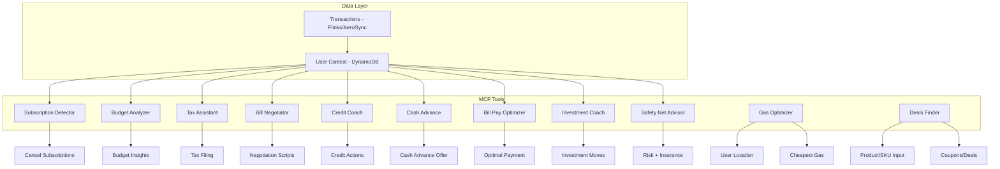

```mermaid
flowchart TB
    subgraph Data Layer
        TX[Transactions - Flinks/AeroSync]
        CTX[User Context - DynamoDB]
    end

    subgraph MCP Tools
        S1[Subscription Detector]
        S2[Budget Analyzer]
        S3[Tax Assistant]
        S4[Gas Optimizer]
        S5[Deals Finder]
        S6[Bill Negotiator]
        S7[Credit Coach]
        S8[Cash Advance]
        S9[Bill Pay Optimizer]
        S10[Investment Coach]
        S11[Safety Net Advisor]
    end

    TX --> CTX

    CTX --> S1
    CTX --> S2
    CTX --> S3
    CTX --> S6
    CTX --> S7
    CTX --> S8
    CTX --> S9
    CTX --> S10
    CTX --> S11

    S4 --> LOC[User Location]
    S5 --> SKU[Product/SKU Input]

    S1 --> OUT1[Cancel Subscriptions]
    S2 --> OUT2[Budget Insights]
    S3 --> OUT3[Tax Filing]
    S4 --> OUT4[Cheapest Gas]
    S5 --> OUT5[Coupons/Deals]
    S6 --> OUT6[Negotiation Scripts]
    S7 --> OUT7[Credit Actions]
    S8 --> OUT8[Cash Advance Offer]
    S9 --> OUT9[Optimal Payment]
    S10 --> OUT10[Investment Moves]
    S11 --> OUT11[Risk + Insurance]

```
