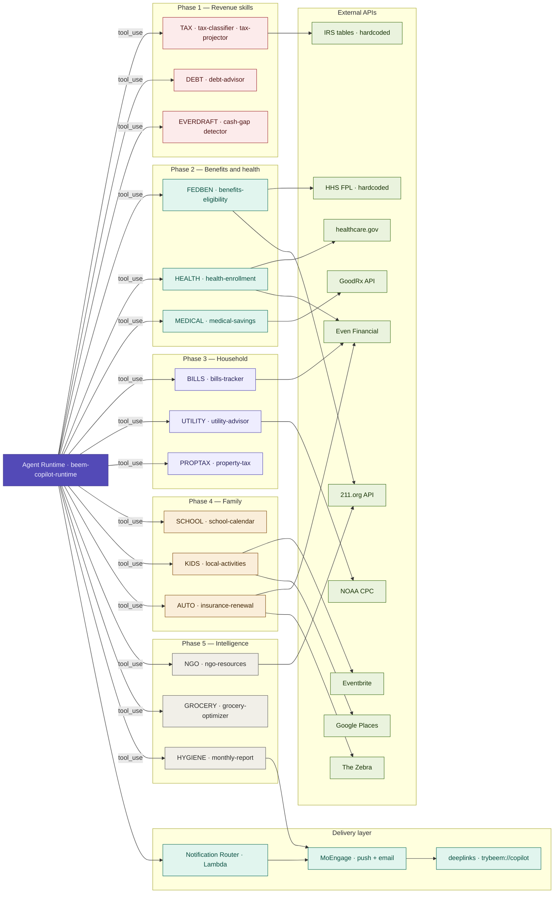

```mermaid
flowchart LR
    RT["Agent Runtime · beem-copilot-runtime"]:::core

    subgraph PHASE1["Phase 1 — Revenue skills"]
        TAX["TAX · tax-classifier · tax-projector"]:::p1
        DEBT["DEBT · debt-advisor"]:::p1
        EVD["EVERDRAFT · cash-gap detector"]:::p1
    end

    subgraph PHASE2["Phase 2 — Benefits and health"]
        FED["FEDBEN · benefits-eligibility"]:::p2
        HLT["HEALTH · health-enrollment"]:::p2
        MED["MEDICAL · medical-savings"]:::p2
    end

    subgraph PHASE3["Phase 3 — Household"]
        BIL["BILLS · bills-tracker"]:::p3
        UTL["UTILITY · utility-advisor"]:::p3
        PRT["PROPTAX · property-tax"]:::p3
    end

    subgraph PHASE4["Phase 4 — Family"]
        SCH["SCHOOL · school-calendar"]:::p4
        KID["KIDS · local-activities"]:::p4
        AUT["AUTO · insurance-renewal"]:::p4
    end

    subgraph PHASE5["Phase 5 — Intelligence"]
        NGO["NGO · ngo-resources"]:::p5
        GRO["GROCERY · grocery-optimizer"]:::p5
        HYG["HYGIENE · monthly-report"]:::p5
    end

    subgraph APIS["External APIs"]
        direction TB
        IRS["IRS tables · hardcoded"]:::api
        HHS["HHS FPL · hardcoded"]:::api
        GRX["GoodRx API"]:::api
        HCG["healthcare.gov"]:::api
        OE["211.org API"]:::api
        EVT["Eventbrite"]:::api
        NOA["NOAA CPC"]:::api
        EF["Even Financial"]:::api
        ZEB["The Zebra"]:::api
        GGL["Google Places"]:::api
    end

    subgraph DELIVERY["Delivery layer"]
        MNG["MoEngage · push + email"]:::del
        NR["Notification Router · Lambda"]:::del
        DL["deeplinks · trybeem://copilot"]:::del
    end

    RT -->|"tool_use"| TAX & DEBT & EVD
    RT -->|"tool_use"| FED & HLT & MED
    RT -->|"tool_use"| BIL & UTL & PRT
    RT -->|"tool_use"| SCH & KID & AUT
    RT -->|"tool_use"| NGO & GRO & HYG

    TAX --> IRS
    FED --> HHS & OE
    HLT --> HCG & EF
    MED --> GRX
    BIL --> EF
    UTL --> NOA
    KID --> EVT & GGL
    AUT --> EF & ZEB
    NGO --> OE
    HYG --> MNG

    RT --> NR --> MNG --> DL

    classDef core fill:#534AB7,stroke:#3C3489,color:#EEEDFE
    classDef p1 fill:#FCEBEB,stroke:#A32D2D,color:#501313
    classDef p2 fill:#E1F5EE,stroke:#0F6E56,color:#085041
    classDef p3 fill:#EEEDFE,stroke:#534AB7,color:#26215C
    classDef p4 fill:#FAEEDA,stroke:#854F0B,color:#412402
    classDef p5 fill:#F1EFE8,stroke:#5F5E5A,color:#2C2C2A
    classDef api fill:#EAF3DE,stroke:#3B6D11,color:#173404
    classDef del fill:#E1F5EE,stroke:#0F6E56,color:#085041

```
