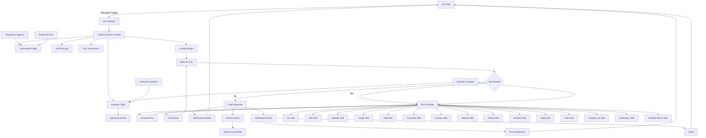

```mermaid
flowchart TD

%% USER
A[User App] -->|Message / Trigger| B[API Gateway]

%% RUNTIME
B --> C[Copilot Runtime Lambda]

%% CONTEXT
C --> D[DynamoDB Profile]
C --> E[KMS Decrypt]
C --> F[VGS Tokenization]

%% CALENDAR
C --> G[Calendar Table]
G --> H[Upcoming Events]

%% PROMPT BUILDING
C --> I[Prompt Builder]

%% LLM
I --> J[Bedrock LLM]

%% TOOL LOOP
J --> K{Tool Needed}

K -->|Yes| L[MCP Lambda]
L --> M[External APIs]
M --> L
L --> N[Tool Result]
N --> J

K -->|No| O[Final Response]

%% RESPONSE
O --> P[WebSocket Stream]
P --> A

%% CONTEXT UPDATE
O --> Q[Extract Entities]
Q --> R[Update DynamoDB]

%% DELIVERY
O --> S[Notification Router]
S --> T[Push Notification]
S --> U[Email]
T --> A
U --> A

%% BACKGROUND JOBS
V[Transaction Ingestor] --> D
W[Profile Enricher] --> D
X[Calendar Populator] --> G
Y[Calendar Evaluator] --> G
Y --> L

%% SKILLS
L --> L1[Tax Skill]
L --> L2[Bills Skill]
L --> L3[Benefits Skill]
L --> L4[Health Skill]
L --> L5[Debt Skill]
L --> L6[Insurance Skill]
L --> L7[Grocery Skill]
L --> L8[Medical Skill]
L --> L9[School Skill]
L --> L10[Activities Skill]
L --> L11[Utility Skill]
L --> L12[NGO Skill]
L --> L13[Property Tax Skill]
L --> L14[Notification Skill]
L --> L15[Monthly Report Skill]
```
