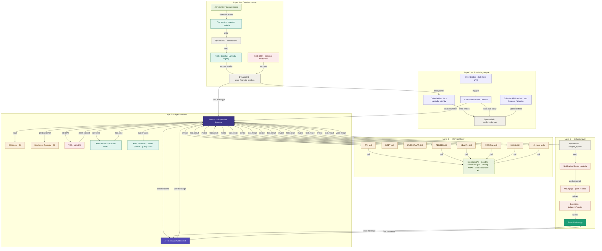

```mermaid
flowchart TD

    subgraph L1["Layer 1 — Data foundation"]
        AS["AeroSync / Flinks webhook"]:::input
        TI["Transaction Ingestor Lambda"]:::l1
        TXN["DynamoDB · transactions"]:::db
        PE["Profile Enricher Lambda · nightly"]:::l1
        UFP["DynamoDB · user_financial_profiles"]:::db
        KMS["KMS CMK · per-user encryption"]:::sec

        AS -->|"webhook event"| TI
        TI -->|"write"| TXN
        TXN -->|"read"| PE
        PE -->|"encrypt + write"| UFP
        KMS -->|"encrypts"| UFP
    end

    subgraph L2["Layer 2 — Scheduling engine"]
        CP["CalendarPopulator Lambda · nightly"]:::l2
        CAL["DynamoDB · copilot_calendar"]:::db
        EB["EventBridge · daily 7am UTC"]:::l2
        CE["CalendarEvaluator Lambda"]:::l2
        CA["CalendarAPI Lambda · add / snooze / dismiss"]:::l2

        UFP -->|"read profile"| CP
        CP -->|"write entries"| CAL
        EB -->|"triggers"| CE
        CE -->|"scan due today"| CAL
        CA -->|"update entries"| CAL
    end

    subgraph L3["Layer 3 — Agent runtime"]
        WS["API Gateway WebSocket"]:::l3
        RT["beem-copilot-runtime Lambda"]:::core
        SOUL["SOUL.md · S3"]:::store
        DISC["Disclaimer Registry · S3"]:::store
        VGS["VGS · strip PII"]:::sec
        BED["AWS Bedrock · Claude Haiku"]:::llm
        SON["AWS Bedrock · Claude Sonnet · quality tasks"]:::llm

        CE -->|"invoke runtime"| RT
        WS -->|"user message"| RT
        UFP -->|"load + decrypt"| RT
        RT -->|"load"| SOUL
        RT -->|"get disclaimer"| DISC
        RT -->|"strip PII"| VGS
        VGS -->|"clean context"| RT
        RT -->|"converse"| BED
        BED -->|"tool_use"| RT
        RT -->|"quality tasks"| SON
    end

    subgraph L4["Layer 4 — MCP tool layer"]
        direction LR
        TAX["TAX skill"]:::l4
        DEBT["DEBT skill"]:::l4
        EVD["EVERDRAFT skill"]:::l4
        FED["FEDBEN skill"]:::l4
        HLT["HEALTH skill"]:::l4
        MED["MEDICAL skill"]:::l4
        BIL["BILLS skill"]:::l4
        OTH["+ 9 more skills"]:::l4

        EXT["External APIs · GoodRx · healthcare.gov · 211.org · NOAA · Even Financial · etc."]:::api

        RT -->|"invoke"| TAX & DEBT & EVD
        RT -->|"invoke"| FED & HLT & MED & BIL & OTH
        TAX & FED & HLT & MED & BIL & OTH -->|"call"| EXT
        TAX & DEBT & EVD & FED & HLT & MED & BIL & OTH -->|"tool_result"| RT
    end

    subgraph L5["Layer 5 — Delivery layer"]
        IQ["DynamoDB · insights_queue"]:::db
        NR["Notification Router Lambda"]:::l5
        MNG["MoEngage · push + email"]:::l5
        RN["React Native app"]:::output
        DL["Deeplinks · trybeem://copilot"]:::l5

        RT -->|"write insight"| IQ
        IQ -->|"read"| NR
        NR -->|"push or email"| MNG
        MNG -->|"deliver"| DL
        DL -->|"opens"| RN
        RT -->|"stream tokens"| WS
        WS -->|"live response"| RN
    end

    RN -->|"user message"| WS

    classDef input fill:#EAF3DE,stroke:#3B6D11,color:#173404
    classDef l1 fill:#E1F5EE,stroke:#0F6E56,color:#085041
    classDef l2 fill:#EEEDFE,stroke:#534AB7,color:#26215C
    classDef l3 fill:#534AB7,stroke:#3C3489,color:#EEEDFE
    classDef core fill:#3C3489,stroke:#26215C,color:#EEEDFE
    classDef l4 fill:#FAEEDA,stroke:#854F0B,color:#412402
    classDef l5 fill:#FAECE7,stroke:#993C1D,color:#4A1B0C
    classDef db fill:#F1EFE8,stroke:#5F5E5A,color:#2C2C2A
    classDef sec fill:#FCEBEB,stroke:#A32D2D,color:#501313
    classDef llm fill:#E1F5EE,stroke:#0F6E56,color:#085041
    classDef store fill:#FAEEDA,stroke:#854F0B,color:#633806
    classDef api fill:#EAF3DE,stroke:#3B6D11,color:#173404
    classDef output fill:#1D9E75,stroke:#0F6E56,color:#E1F5EE
```
