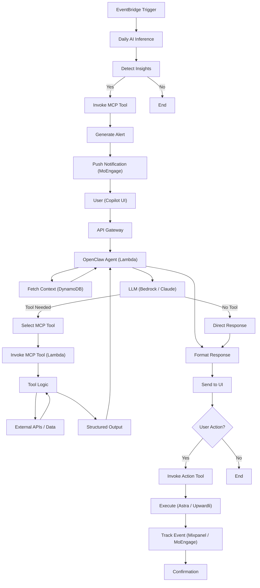

```mermaid
flowchart TD

%% USER FLOW
A["User (Copilot UI)"] --> B["API Gateway"]
B --> C["OpenClaw Agent (Lambda)"]

C --> D["Fetch Context (DynamoDB)"]
D --> C

C --> E["LLM (Bedrock / Claude)"]

E -->|Tool Needed| F["Select MCP Tool"]
E -->|No Tool| G["Direct Response"]

F --> H["Invoke MCP Tool (Lambda)"]
H --> I["Tool Logic"]

I --> J["External APIs / Data"]
J --> I

I --> K["Structured Output"]
K --> C

C --> L["Format Response"]
G --> L

L --> M["Send to UI"]

%% USER ACTION
M --> N{"User Action?"}

N -->|Yes| O["Invoke Action Tool"]
O --> P["Execute (Astra / Upwardli)"]
P --> Q["Track Event (Mixpanel / MoEngage)"]
Q --> R["Confirmation"]

N -->|No| S["End"]

%% PROACTIVE FLOW
T["EventBridge Trigger"] --> U["Daily AI Inference"]
U --> V["Detect Insights"]

V -->|Yes| W["Invoke MCP Tool"]
W --> X["Generate Alert"]

X --> Y["Push Notification (MoEngage)"]
Y --> A

V -->|No| Z["End"]
```
