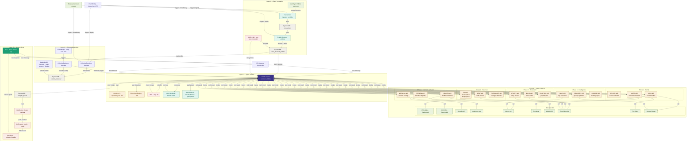

```mermaid
%%{init: {'theme':'default', 'themeVariables': {
    'fontSize': '22px',
    'primaryTextColor': '#000',
    'lineColor': '#333'
}}}%%
flowchart TD

    %% ─── Entry point ───────────────────────────────────────────────
    USER["User · React Native app"]:::output
    WS["API Gateway WebSocket"]:::infra
    USER -->|"user message"| WS

    %% ─── Layer 1 · Data foundation ─────────────────────────────────
    subgraph L1["Layer 1 — Data foundation"]
        AS["AeroSync / Flinks webhook"]:::input
        TI["Transaction Ingestor Lambda"]:::l1
        TXN["DynamoDB · transactions"]:::db
        PE["Profile Enricher Lambda"]:::l1
        UFP["DynamoDB · user_financial_profiles"]:::db
        KMS["KMS CMK · per-user encryption"]:::sec

        AS -->|"webhook event"| TI
        TI -->|"write"| TXN
        TXN -->|"read"| PE
        PE -->|"encrypt + write"| UFP
        KMS -->|"encrypts"| UFP
    end

    %% PE and TI triggered by EventBridge nightly
    EB_ENRICH["EventBridge · nightly 2am UTC"]:::infra
    EB_ENRICH -->|"triggers nightly"| PE
    EB_ENRICH -->|"triggers nightly"| TI

    %% ─── Layer 2 · Scheduling engine ───────────────────────────────
    subgraph L2["Layer 2 — Scheduling engine"]
        CP["CalendarPopulator Lambda"]:::l2
        CAL["DynamoDB · copilot_calendar"]:::db
        EB_CAL["EventBridge · daily 7am UTC"]:::l2
        CE["CalendarEvaluator Lambda"]:::l2
        CA["CalendarAPI Lambda · add / snooze / dismiss"]:::l2

        CP -->|"write entries"| CAL
        EB_CAL -->|"triggers"| CE
        CE -->|"scan due today"| CAL
        CA -->|"update entries"| CAL
    end

    %% What triggers CalendarPopulator
    UFP -->|"read profile"| CP
    EB_ENRICH -->|"triggers nightly"| CP
    NEW_USER["New user account created"]:::input
    NEW_USER -->|"triggers immediately"| CP
    NEW_USER -->|"triggers immediately"| TI

    %% ─── Layer 3 · Agent runtime ────────────────────────────────────
    subgraph L3["Layer 3 — Agent runtime"]
        RT["beem-copilot-runtime Lambda"]:::core
        SOUL["SOUL.md + openclaw.json · S3"]:::store
        DISC["Disclaimer Registry · S3"]:::store
        VGS["VGS · strip PII"]:::sec
        BED["AWS Bedrock · Claude Haiku"]:::llm
        SON["AWS Bedrock · Claude Sonnet · quality tasks"]:::llm

        RT -->|"load"| SOUL
        RT -->|"get disclaimer"| DISC
        RT -->|"strip PII"| VGS
        VGS -->|"clean context"| RT
        RT -->|"converse"| BED
        BED -->|"tool_use"| RT
        RT -->|"quality tasks"| SON
    end

    %% What feeds the runtime
    WS -->|"user message"| RT
    CE -->|"calendar trigger"| RT
    UFP -->|"load + decrypt"| RT
    KMS -->|"decrypt key"| RT

    %% ─── Layer 4 · MCP tool layer ───────────────────────────────────
    subgraph L4["Layer 4 — MCP tool layer"]
        direction TB

        subgraph PHASE1["Phase 1 · Revenue"]
            TAX["TAX skill\ntax-classifier\ntax-projector"]:::l4
            DEBT["DEBT skill\ndebt-advisor"]:::l4
            EVD["EVERDRAFT skill\ncash-gap detector"]:::l4
        end

        subgraph PHASE2["Phase 2 · Benefits & health"]
            FED["FEDBEN skill\nbenefits-eligibility"]:::l4
            HLT["HEALTH skill\nhealth-enrollment"]:::l4
            MED["MEDICAL skill\nmedical-savings"]:::l4
        end

        subgraph PHASE3["Phase 3 · Household"]
            BIL["BILLS skill\nbills-tracker"]:::l4
            UTL["UTILITY skill\nutility-advisor"]:::l4
            PRT["PROPTAX skill\nproperty-tax"]:::l4
        end

        subgraph PHASE4["Phase 4 · Family"]
            SCH["SCHOOL skill\nschool-calendar"]:::l4
            KID["KIDS skill\nlocal-activities"]:::l4
            AUT["AUTO skill\ninsurance-renewal"]:::l4
        end

        subgraph PHASE5["Phase 5 · Intelligence"]
            NGO["NGO skill\nngo-resources"]:::l4
            GRO["GROCERY skill\ngrocery-optimizer"]:::l4
            HYG["HYGIENE skill\nmonthly-report"]:::l4
        end

        subgraph EXTAPIS["External APIs"]
            direction TB
            IRS["IRS tables · hardcoded"]:::api
            HHS["HHS FPL · hardcoded"]:::api
            GRX["GoodRx API"]:::api
            HCG["healthcare.gov"]:::api
            OE["211.org API"]:::api
            EVT["Eventbrite"]:::api
            NOA["NOAA CPC"]:::api
            EF["Even Financial"]:::api
            ZEB["The Zebra"]:::api
            GGL["Google Places"]:::api
        end

        TAX -->|"call"| IRS
        FED -->|"call"| HHS
        FED -->|"call"| OE
        HLT -->|"call"| HCG
        HLT -->|"call"| EF
        MED -->|"call"| GRX
        DEBT -->|"call"| EF
        BIL -->|"call"| EF
        UTL -->|"call"| NOA
        AUT -->|"call"| EF
        AUT -->|"call"| ZEB
        KID -->|"call"| EVT
        KID -->|"call"| GGL
        NGO -->|"call"| OE
        GRO -->|"call"| GGL
    end

    %% Runtime invokes each skill
    RT -->|"invoke"| TAX
    RT -->|"invoke"| DEBT
    RT -->|"invoke"| EVD
    RT -->|"invoke"| FED
    RT -->|"invoke"| HLT
    RT -->|"invoke"| MED
    RT -->|"invoke"| BIL
    RT -->|"invoke"| UTL
    RT -->|"invoke"| PRT
    RT -->|"invoke"| SCH
    RT -->|"invoke"| KID
    RT -->|"invoke"| AUT
    RT -->|"invoke"| NGO
    RT -->|"invoke"| GRO
    RT -->|"invoke"| HYG

    %% Skills return results
    TAX -->|"tool_result"| RT
    DEBT -->|"tool_result"| RT
    EVD -->|"tool_result"| RT
    FED -->|"tool_result"| RT
    HLT -->|"tool_result"| RT
    MED -->|"tool_result"| RT
    BIL -->|"tool_result"| RT
    UTL -->|"tool_result"| RT
    PRT -->|"tool_result"| RT
    SCH -->|"tool_result"| RT
    KID -->|"tool_result"| RT
    AUT -->|"tool_result"| RT
    NGO -->|"tool_result"| RT
    GRO -->|"tool_result"| RT
    HYG -->|"tool_result"| RT

    %% Delivery
    subgraph L5["Layer 5 — Delivery layer"]
        IQ["DynamoDB · insights_queue"]:::db
        NR["Notification Router Lambda"]:::l5
        MNG["MoEngage · push + email"]:::l5
        DL["Deeplinks · trybeem://copilot"]:::l5

        IQ -->|"read"| NR
        NR -->|"push or email"| MNG
        MNG -->|"delivers via"| DL
        DL -->|"opens app to"| USER
    end

    RT -->|"write insight"| IQ
    RT -->|"stream tokens"| WS
    WS -->|"live response"| USER

    %% styles (IMPORTANT)
    classDef input fill:#EAF3DE,stroke:#3B6D11,color:#173404,font-size:22px
    classDef output fill:#1D9E75,stroke:#0F6E56,color:#E1F5EE,font-size:22px
    classDef infra fill:#EEEDFE,stroke:#534AB7,color:#26215C,font-size:22px
    classDef l1 fill:#E1F5EE,stroke:#0F6E56,color:#085041,font-size:22px
    classDef l2 fill:#EEEDFE,stroke:#534AB7,color:#26215C,font-size:22px
    classDef l3 fill:#534AB7,stroke:#3C3489,color:#EEEDFE,font-size:22px
    classDef core fill:#3C3489,stroke:#26215C,color:#EEEDFE,font-size:22px
    classDef l4 fill:#FAEEDA,stroke:#854F0B,color:#412402,font-size:22px
    classDef l5 fill:#FAECE7,stroke:#993C1D,color:#4A1B0C,font-size:22px
    classDef db fill:#F1EFE8,stroke:#5F5E5A,color:#2C2C2A,font-size:22px
    classDef sec fill:#FCEBEB,stroke:#A32D2D,color:#501313,font-size:22px
    classDef llm fill:#E1F5EE,stroke:#0F6E56,color:#085041,font-size:22px
    classDef store fill:#FAEEDA,stroke:#854F0B,color:#633806,font-size:22px
    classDef api fill:#EAF3DE,stroke:#3B6D11,color:#173404,font-size:22px
```
