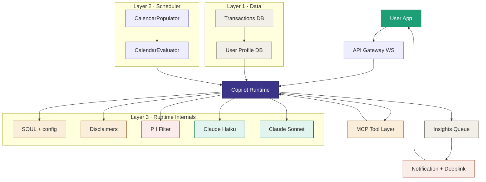

```mermaid
%%{init: {'theme':'default', 'themeVariables': {
    'fontSize': '18px',
    'primaryTextColor': '#000',
    'lineColor': '#333'
}}}%%
flowchart TD

    %% ─── MAIN FLOW (VERTICAL SPINE) ───
    USER["User App"]:::output
    WS["API Gateway WS"]:::infra
    RT["Copilot Runtime"]:::core
    L4["MCP Tool Layer"]:::l4
    IQ["Insights Queue"]:::db
    DELIV["Notification + Deeplink"]:::l5

    USER --> WS --> RT --> L4 --> RT --> IQ --> DELIV --> USER

    %% ─── DATA LAYER ───
    subgraph DATA["Layer 1 · Data"]
        TXN["Transactions DB"]:::db
        UFP["User Profile DB"]:::db
    end

    %% ─── SCHEDULER ───
    subgraph SCHED["Layer 2 · Scheduler"]
        CP["CalendarPopulator"]:::l2
        CE["CalendarEvaluator"]:::l2
    end

    %% ─── RUNTIME INTERNALS ───
    subgraph RUNTIME["Layer 3 · Runtime Internals"]
        SOUL["SOUL + config"]:::store
        DISC["Disclaimers"]:::store
        VGS["PII Filter"]:::sec
        BED["Claude Haiku"]:::llm
        SON["Claude Sonnet"]:::llm
    end

    %% ─── CONNECTIONS (CLEAN SIDE LINKS) ───

    TXN --> UFP
    UFP --> RT

    CP --> CE
    CE --> RT

    RT --> SOUL
    RT --> DISC
    RT --> VGS
    RT --> BED
    RT --> SON

    %% styles
    classDef output fill:#1D9E75,stroke:#0F6E56,color:#fff
    classDef infra fill:#EEEDFE,stroke:#534AB7
    classDef core fill:#3C3489,stroke:#26215C,color:#fff
    classDef l4 fill:#FAEEDA,stroke:#854F0B
    classDef l5 fill:#FAECE7,stroke:#993C1D
    classDef db fill:#F1EFE8,stroke:#5F5E5A
    classDef l2 fill:#EEEDFE,stroke:#534AB7
    classDef sec fill:#FCEBEB,stroke:#A32D2D
    classDef llm fill:#E1F5EE,stroke:#0F6E56
    classDef store fill:#FAEEDA,stroke:#854F0B
```
