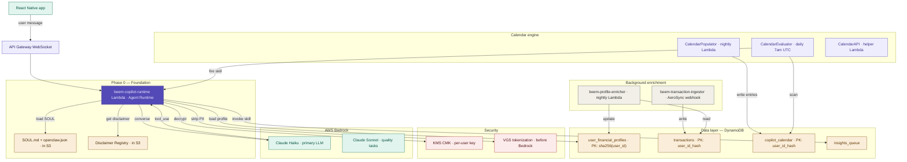

```mermaid
flowchart TD
    RN["React Native app"]:::client
    WS["API Gateway WebSocket"]:::infra

    subgraph FOUNDATION["Phase 0 — Foundation"]
        direction TB
        RUNTIME["beem-copilot-runtime Lambda · Agent Runtime"]:::core
        SOUL["SOUL.md + openclaw.json · in S3"]:::store
        DISC["Disclaimer Registry · in S3"]:::store
    end

    subgraph DATASTORE["Data layer — DynamoDB"]
        direction LR
        UFP["user_financial_profiles · PK: sha256(user_id)"]:::db
        TXN["transactions · PK: user_id_hash"]:::db
        CAL["copilot_calendar · PK: user_id_hash"]:::db
        IQ["insights_queue"]:::db
    end

    subgraph CALENDAR["Calendar engine"]
        direction LR
        CP["CalendarPopulator · nightly Lambda"]:::sched
        CE["CalendarEvaluator · daily 7am UTC"]:::sched
        CA["CalendarAPI · helper Lambda"]:::sched
    end

    subgraph ENRICHMENT["Background enrichment"]
        direction LR
        PE["beem-profile-enricher · nightly Lambda"]:::bg
        TI["beem-transaction-ingestor · AeroSync webhook"]:::bg
    end

    subgraph SECURITY["Security"]
        direction LR
        KK["KMS CMK · per-user key"]:::sec
        VG["VGS tokenization · before Bedrock"]:::sec
    end

    subgraph BEDROCK["AWS Bedrock"]
        direction LR
        HAI["Claude Haiku · primary LLM"]:::llm
        SON["Claude Sonnet · quality tasks"]:::llm
    end

    RN -->|"user message"| WS
    WS --> RUNTIME
    RUNTIME -->|"load profile"| UFP
    RUNTIME -->|"decrypt"| KK
    RUNTIME -->|"strip PII"| VG
    RUNTIME -->|"load SOUL"| SOUL
    RUNTIME -->|"get disclaimer"| DISC
    RUNTIME -->|"converse"| HAI
    HAI -->|"tool_use"| RUNTIME
    RUNTIME -->|"invoke skill"| IQ
    CE -->|"fire skill"| RUNTIME
    CP -->|"write entries"| CAL
    CE -->|"scan"| CAL
    PE -->|"update"| UFP
    TI -->|"write"| TXN
    PE -->|"read"| TXN

    classDef client fill:#E1F5EE,stroke:#0F6E56,color:#085041
    classDef infra fill:#EEEDFE,stroke:#534AB7,color:#26215C
    classDef core fill:#534AB7,stroke:#3C3489,color:#EEEDFE
    classDef store fill:#FAEEDA,stroke:#854F0B,color:#412402
    classDef db fill:#FAEEDA,stroke:#854F0B,color:#633806
    classDef sched fill:#EEEDFE,stroke:#534AB7,color:#3C3489
    classDef bg fill:#F1EFE8,stroke:#5F5E5A,color:#2C2C2A
    classDef sec fill:#FCEBEB,stroke:#A32D2D,color:#501313
    classDef llm fill:#E1F5EE,stroke:#0F6E56,color:#085041
```
